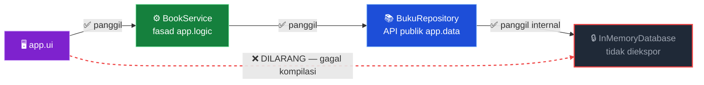

<div align="center">

<!-- ASCII Art Banner SVG -->


<br/>


<br/><br/>

<!-- Badges -->
<p>
  
  &nbsp;
  
  &nbsp;
  
  &nbsp;
  
  &nbsp;
  
</p>

<p><sub>Proyek tugas praktikum <b>Studi Kasus Modular</b> — dibangun murni dari CLI menggunakan Java Platform Module System (JPMS).</sub></p>

</div>

---

## 📖 Daftar Isi

| # | Bagian |
|---|--------|
| 1 | [🧩 Struktur Modul](#-struktur-modul) |
| 2 | [🔒 Strong Encapsulation](#-strong-encapsulation) |
| 3 | [🗂️ Struktur Folder](#️-struktur-folder) |
| 4 | [🚀 Cara Menjalankan](#-cara-menjalankan) |
| 5 | [🖥️ Fitur CLI](#️-fitur-cli) |
| 6 | [✅ Ketentuan Tugas](#-ketentuan-tugas) |
| 7 | [👥 Anggota Kelompok](#-anggota-kelompok) |

---

## 🧩 Struktur Modul

Sistem dipecah menjadi **3 modul independen**, masing-masing dengan tanggung jawab tunggal:

<div align="center">

| Modul | 🎯 Tanggung Jawab | 📤 Mengekspor |
|:---:|:---|:---|
| `app.data` | Entitas data (`Buku`, `Kategori`) & simulasi database internal (`InMemoryDatabase`) | `com.bookstore.data.entity`<br>`com.bookstore.data.repository` |
| `app.logic` | Logika bisnis: diskon, hitung total, validasi stok | `com.bookstore.logic.service`<br>`com.bookstore.logic.dto` |
| `app.ui` | CLI interaktif, menerima input pengguna, **main entry point** | *(tidak mengekspor apa pun)* |

</div>

### 🔗 Diagram Dependensi


### ⚙️ Konfigurasi `module-info.java`

```java
// ── app.data ──────────────────────────────────
module app.data {
    exports com.bookstore.data.entity;
    exports com.bookstore.data.repository;
    // com.bookstore.data.internal → TIDAK diekspor 🔒
}

// ── app.logic ─────────────────────────────────
module app.logic {
    requires transitive app.data;
    exports com.bookstore.logic.service;
    exports com.bookstore.logic.dto;
}

// ── app.ui ────────────────────────────────────
module app.ui {
    requires app.logic;
}
```

---

## 🔒 Strong Encapsulation

> ⛔ `app.ui` **tidak boleh** mengakses `com.bookstore.data.internal` secara langsung.

Paket `com.bookstore.data.internal` — tempat `InMemoryDatabase` berada — tidak pernah diekspor. Java Module System menegakkan *strong encapsulation*: kompilasi **langsung gagal** jika ada modul lain yang mencoba mengimpornya.

```text
error: package com.bookstore.data.internal is not visible
  (package com.bookstore.data.internal is declared in module
   app.data, which does not export it)
```

### 🛡️ Rantai Komunikasi yang Benar



---

## 🗂️ Struktur Folder

```
bookstore-modular/
│
├── 📦 app.data/
│   ├── module-info.java
│   └── com/bookstore/data/
│       ├── entity/          ← Buku, Kategori
│       ├── repository/      ← BukuRepository  (API publik ✅)
│       └── internal/        ← InMemoryDatabase (tersembunyi 🔒)
│
├── ⚙️  app.logic/
│   ├── module-info.java
│   └── com/bookstore/logic/
│       ├── service/         ← BookService, DiscountService
│       └── dto/             ← HasilTransaksi
│
├── 🖥️  app.ui/
│   ├── module-info.java
│   └── com/bookstore/ui/
│       ├── Main.java        ← entry point CLI
│       └── Console.java     ← helper tampilan ANSI
│
├── build.sh
└── run.sh
```

---

## 🚀 Cara Menjalankan

> **Prasyarat:** JDK 11 atau lebih baru — *diuji pada JDK 21*

### Opsi 1 — Script (Disarankan)

```bash
chmod +x build.sh run.sh
./build.sh   # kompilasi 3 modul ke mods/
./run.sh     # jalankan CLI
```

### Opsi 2 — Manual via CLI

```bash
# 1. Kompilasi app.data
javac -d mods/app.data \
  $(find app.data -name "*.java")

# 2. Kompilasi app.logic (butuh app.data)
javac --module-path mods \
  -d mods/app.logic \
  $(find app.logic -name "*.java")

# 3. Kompilasi app.ui (butuh app.logic)
javac --module-path mods \
  -d mods/app.ui \
  $(find app.ui -name "*.java")

# 4. Jalankan
java --module-path mods \
  -m app.ui/com.bookstore.ui.Main
```

---

## 🖥️ Fitur CLI

Tampilan CLI menggunakan ANSI color codes untuk pengalaman terminal yang nyaman:

```
╔════════════════════════════════════════════╗
║               MENU UTAMA                   ║
╠════════════════════════════════════════════╣
║  [1]  Tampilkan semua buku                 ║
║  [2]  Cari buku berdasarkan kategori       ║
║  [3]  Beli buku                            ║
║  [4]  Tambah buku baru                     ║
║  [0]  Keluar                               ║
╚════════════════════════════════════════════╝
  › Pilih menu:
```

| Fitur | Deskripsi |
|:---:|:---|
| 📋 **Katalog** | Tabel rapi dengan warna ANSI — stok menipis ditampilkan merah |
| 💳 **Beli Buku** | Hitung diskon bertingkat otomatis (5% / 10% / 15%), cetak struk, validasi & kurangi stok via `app.logic` |
| ➕ **Tambah Buku** | Tambah entri katalog baru secara *runtime* |

---

## ✅ Ketentuan Tugas

- [x] Setiap modul memiliki `module-info.java` yang terkonfigurasi benar
- [x] `app.ui` tidak mengakses paket internal `app.data` secara langsung *(terverifikasi via error kompilasi)*
- [x] Format pengumpulan: unggah repo ke GitHub, tautkan ke LMS
- [x] Kelompok maksimal 3 mahasiswa

---

## 👥 Anggota Kelompok

<div align="center">

| No | Nama | NIM |
|:---:|:---|:---|
| 1 | Dimas Maycardo Sihotang | 202333500844 |
| 2 | Rianca Aril Pratama | 202333500851 |
| 3 | Muhammad Jalaluddin Gassing | 202333500858 |

<br/>


</div>
