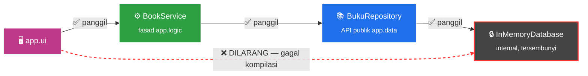

<div align="center">


# 📚 BookStore
### Sistem Manajemen Toko Buku Digital — Arsitektur Modular

<p>
  
  
  
  
  
</p>

<sub>Proyek tugas praktikum <b>Studi Kasus Modular</b> — dibangun murni dari CLI menggunakan Java Platform Module System (JPMS).</sub>

</div>

<br>


## 📖 Daftar Isi

- [🧩 Struktur Modul](#-struktur-modul)
- [🔒 Strong Encapsulation](#-strong-encapsulation--larangan-akses-internal)
- [🗂️ Struktur Folder](#️-struktur-folder)
- [🚀 Cara Menjalankan](#-cara-menjalankan)
- [🖥️ Fitur CLI](#️-fitur-cli)
- [✅ Ketentuan Tugas](#-ketentuan-tugas-yang-dipenuhi)
- [👥 Anggota Kelompok](#-anggota-kelompok)


## 🧩 Struktur Modul

Sistem dipecah menjadi **3 modul independen**, masing-masing dengan tanggung jawab tunggal:

<div align="center">

| Modul | 🎯 Tanggung Jawab | 📤 Mengekspor |
|:---:|:---|:---|
| **`app.data`** | Entitas data (`Buku`, `Kategori`) & simulasi database internal (`InMemoryDatabase`) | `com.bookstore.data.entity`<br>`com.bookstore.data.repository` |
| **`app.logic`** | Logika bisnis: diskon, hitung total, validasi stok | `com.bookstore.logic.service`<br>`com.bookstore.logic.dto` |
| **`app.ui`** | CLI interaktif, menerima input pengguna, **main entry point** | *(tidak mengekspor apa pun)* |

</div>

### 🔗 Diagram Alur Dependensi


### ⚙️ Konfigurasi `module-info.java`

```java
// app.data
module app.data {
    exports com.bookstore.data.entity;
    exports com.bookstore.data.repository;
}

// app.logic
module app.logic {
    requires transitive app.data;
    exports com.bookstore.logic.service;
    exports com.bookstore.logic.dto;
}

// app.ui
module app.ui {
    requires app.logic;
}
```


## 🔒 Strong Encapsulation — Larangan Akses Internal

> ⛔ **`app.ui` TIDAK BOLEH mengakses `app.data.internal`**

Paket `com.bookstore.data.internal` — tempat `InMemoryDatabase` berada — **tidak pernah diekspor** oleh `app.data`. Karena `app.ui` hanya `requires app.logic` dan tidak pernah mengimpor paket internal tersebut, Java Module System menegakkan **strong encapsulation**: kompilasi akan **gagal** jika ada kode di `app.ui` (atau modul lain mana pun) mencoba mengimpor `com.bookstore.data.internal.*` secara langsung.

Ini sudah diverifikasi. Mencoba mengimpor paket itu dari modul lain menghasilkan:

```text
error: package com.bookstore.data.internal is not visible
  (package com.bookstore.data.internal is declared in module app.data, which does not export it)
```

### 🛡️ Rantai Komunikasi yang Benar



`app.ui` hanya berbicara dengan `BookService` (fasad di `app.logic`), yang di baliknya memanggil `BukuRepository` (API publik `app.data`) → `InMemoryDatabase` (internal, tersembunyi).


## 🗂️ Struktur Folder

<details open>
<summary><b>📂 Klik untuk lihat/sembunyikan struktur lengkap</b></summary>

```text
bookstore-modular/
├── app.data/
│   ├── module-info.java
│   └── com/bookstore/data/
│       ├── entity/        # Buku, Kategori
│       ├── repository/    # BukuRepository — API publik
│       └── internal/      # InMemoryDatabase — TIDAK diekspor 🔒
│
├── app.logic/
│   ├── module-info.java
│   └── com/bookstore/logic/
│       ├── service/       # BookService, DiscountService
│       └── dto/           # HasilTransaksi
│
├── app.ui/
│   ├── module-info.java
│   └── com/bookstore/ui/
│       ├── Main.java       # entry point CLI
│       └── Console.java    # helper tampilan ANSI
│
├── build.sh
└── run.sh
```

</details>


## 🚀 Cara Menjalankan

> 💡 Butuh **JDK 11+** (memakai fitur module system) — *tested di JDK 21*

### Opsi 1 — Pakai Script (disarankan)

```bash
chmod +x build.sh run.sh
./build.sh   # kompilasi 3 modul secara berurutan ke mods/
./run.sh     # jalankan CLI
```

### Opsi 2 — Manual via CLI

```bash
javac -d mods/app.data $(find app.data -name "*.java")
javac --module-path mods -d mods/app.logic $(find app.logic -name "*.java")
javac --module-path mods -d mods/app.ui $(find app.ui -name "*.java")
java  --module-path mods -m app.ui/com.bookstore.ui.Main
```


## 🖥️ Fitur CLI

```text
╔════════════════════════════════════════════════════════════════╗
║                         MENU UTAMA                              ║
╚════════════════════════════════════════════════════════════════╝
  [1]  Tampilkan semua buku
  [2]  Cari buku berdasarkan kategori
  [3]  Beli buku
  [4]  Tambah buku baru
  [0]  Keluar
```

| Fitur | Deskripsi |
|---|---|
| 📋 **Katalog** | Tabel rapi dengan warna ANSI — stok menipis ditampilkan **merah** |
| 💳 **Beli Buku** | Otomatis hitung diskon bertingkat (5% / 10% / 15%), cetak struk, validasi & kurangi stok lewat `app.logic` |
| ➕ **Tambah Buku** | Menambah entri katalog baru secara *runtime* |


## ✅ Ketentuan Tugas yang Dipenuhi

- [x] Setiap modul punya `module-info.java` terkonfigurasi benar
- [x] `app.ui` tidak mengakses paket internal `app.data` secara langsung *(terverifikasi gagal-kompilasi jika dicoba)*
- [x] Format pengumpulan: unggah repo ini ke GitHub, lalu tautannya ke LMS
- [x] Kelompok maksimal 3 mahasiswa — isi nama anggota di bawah ini


## 👥 Anggota Kelompok

<div align="center">

| No | Nama | NIM |
|:---:|:---|:---|
| 1 | _Dimas Maycardo Sihotang_ | _202333500844_ |
| 2 | _Rianca Aril Pratama_ | _202333500851_ |
| 3 | _Muhammad Jalaluddin Gassing_ | _2023335008585_ |

</div>

<br>

<div align="center">
<sub>Dibangun dengan ☕ dan Java Platform Module System</sub>
</div>
